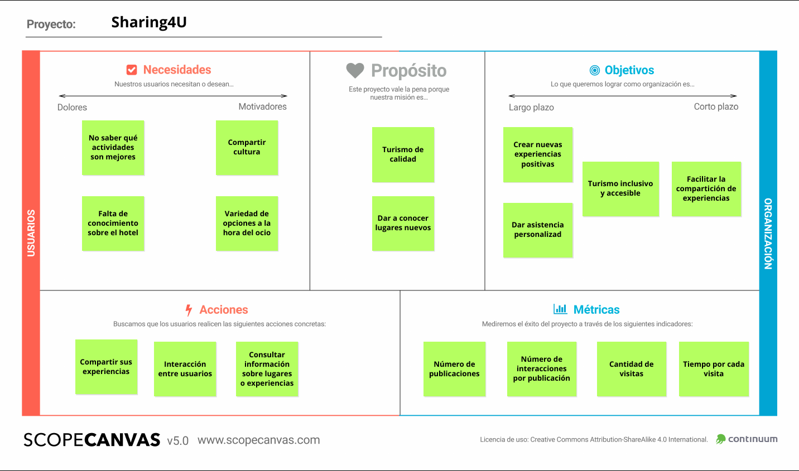
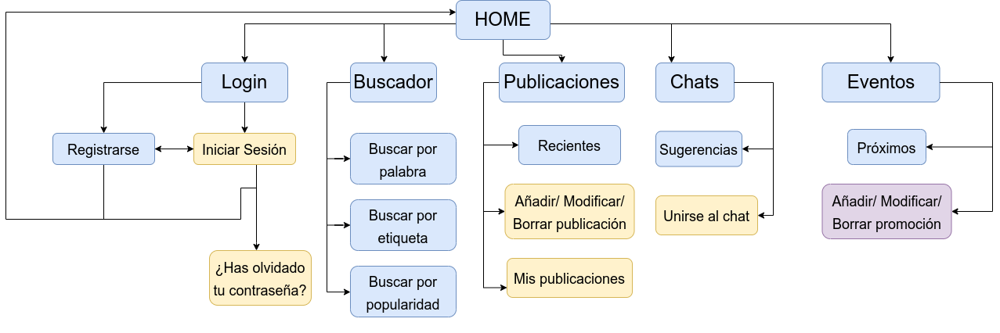
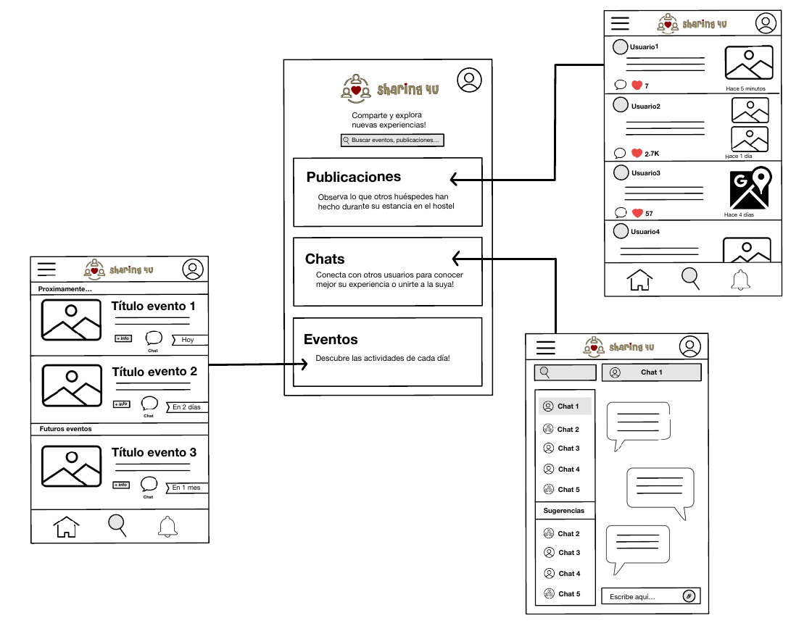
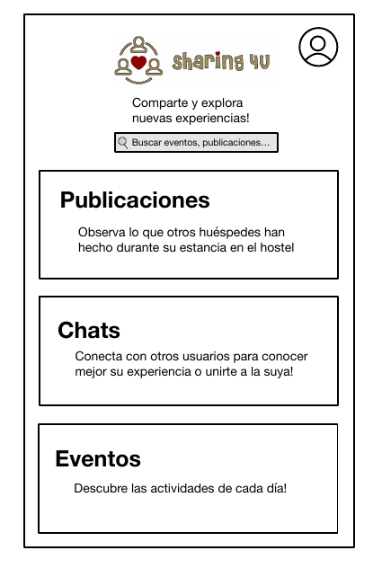
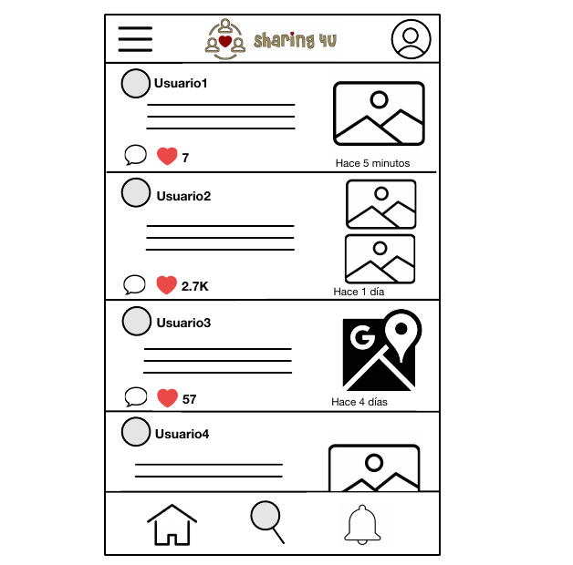
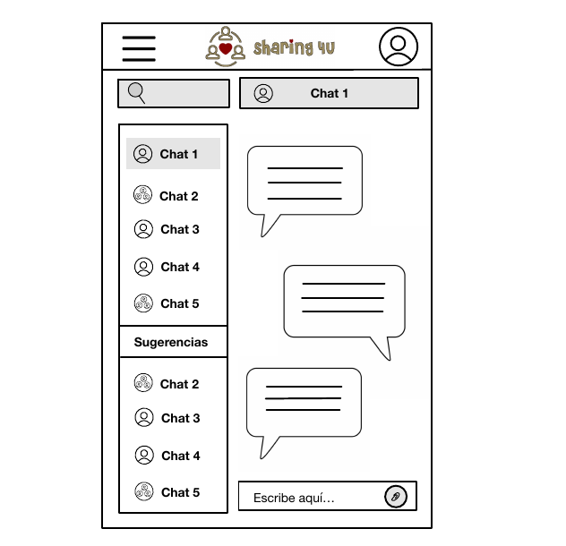
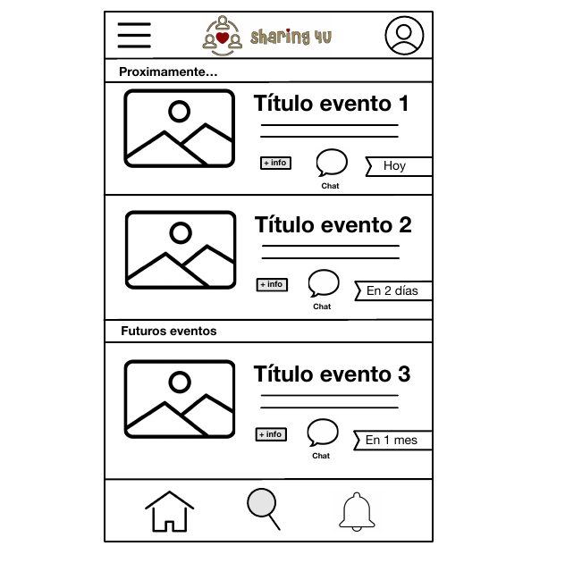

## DIU - Practica2

### IDEACIÓN 
Hemos realizado una malla receptora de información basándonos en las experiencias de nuestros usuarios ficticios de la práctica 1. Para ello, nos hemos planteado qué sugerencias podrían tener los usuarios y cuáles tendrían los desarrolladores:

### PROPUESTA DE VALOR
Nuestra propuesta es crear una plataforma que brinde un espacio en el que los usuarios puedan compartir sus experiencias en su viaje. Pueden compartir su opinión sobre el hostel y recomendar distintas actividades de ocio cercanas o lugares a visitar.

### TASK ANALYSIS

En esta tabla se identifican las tareas y su relevancia para los usuarios. Distinguimos entre tres grupos de usuario:

- **Usuarios Registrados**: Usuario con una cuenta creada en la aplicación. Podrá postear e interactuar con otros usuarios registrados

- **Usuarios No Registrados**: Usuario que visita la aplicación y podrá ver las diferentes publicaciones.

- **Moderador**: Personal del hostel que publica diferentes ofertas y también controla que los usuarios sigan las normas de la comunidad.

  En negrita están las tareas más importantes:

|    Grupos de usuario    | Usuarios Registrados | Usuarios No Registrados | Moderador |
| :---------------------: | :------------------: | :---------------------: | :-------: |
| **Buscar actividades**  |         ALTA         |          ALTA           |   BAJA    |
| **Añadir comentarios**  |        MEDIA         |        NO PUEDE         |   BAJA    |
|  Eliminar comentarios   |         BAJA         |        NO PUEDE         |   MEDIA   |
|   Editar comentarios    |         BAJA         |        NO PUEDE         |   BAJA    |
| **Añadir publicación**  |         ALTA         |        NO PUEDE         |   MEDIA   |
|  Eliminar publicación   |         BAJA         |        NO PUEDE         |   MEDIA   |
|   Editar publicación    |         BAJA         |        NO PUEDE         |   BAJA    |
|     **Registrarse**     |       NO PUEDE       |          MEDIA          | NO PUEDE  |
|   **Iniciar sesión**    |         ALTA         |        NO PUEDE         |   ALTA    |
|      Cerrar sesión      |        MEDIA         |        NO PUEDE         |   BAJA    |
|      Darse de baja      |         BAJA         |        NO PUEDE         |   BAJA    |
|     Cambiar idioma      |        MEDIA         |          MEDIA          |   BAJA    |
|     Banear cuentas      |       NO PUEDE       |        NO PUEDE         |   MEDIA   |
|   **Unirse a chats**    |         ALTA         |        NO PUEDE         |   MEDIA   |
|    Salirse de chats     |         BAJA         |        NO PUEDE         |   BAJA    |
| **Filtrar actividades** |         ALTA         |          ALTA           |   MEDIA   |
|  **Consultar eventos**  |         ALTA         |          ALTA           |   BAJA    |
|  Recuperar contraseña   |         BAJA         |        NO PUEDE         |   BAJA    |
|     Añadir eventos      |       NO PUEDE       |        NO PUEDE         |   MEDIA   |
|     Retirar eventos     |       NO PUEDE       |        NO PUEDE         |   MEDIA   |

### ARQUITECTURA DE INFORMACIÓN

### SiteMap

Desarrollamos el mapa web de la aplicación. En azul indicamos las páginas a las que puede acceder todos los tipos de usuario, en amarillo aparecen las páginas a las cuales pueden acceder los usuarios registrados y moderadores y en morado a las que solo pueden acceder los moderadores.

### Prototipo Lo-FI Wireframe 

Finalmente, hemos realizado un prototipo Lo-Fi de nuestra aplicación (es una aplicación móvil, que también tendrá una versión web). Este prototipo es esquemático y es solo para tener un esquema general. Los detalles de diseño finales los ultimaremos en las siguientes prácticas.

#### Esquema general

 

##### Página de inicio

##### Publicaciones

##### Chats

##### Eventos

### Conclusiones  

En esta etapa, atendiendo a las necesidades de nuestros usuarios, hemos desarrollado una idea y hemos comenzado a darle forma, definiendo nuestros propósitos. También, hemos comenzado con un primer posible diseño esquemático de nuestra aplicación, del cual definiremos mejor el estilo en las próximas prácticas.
