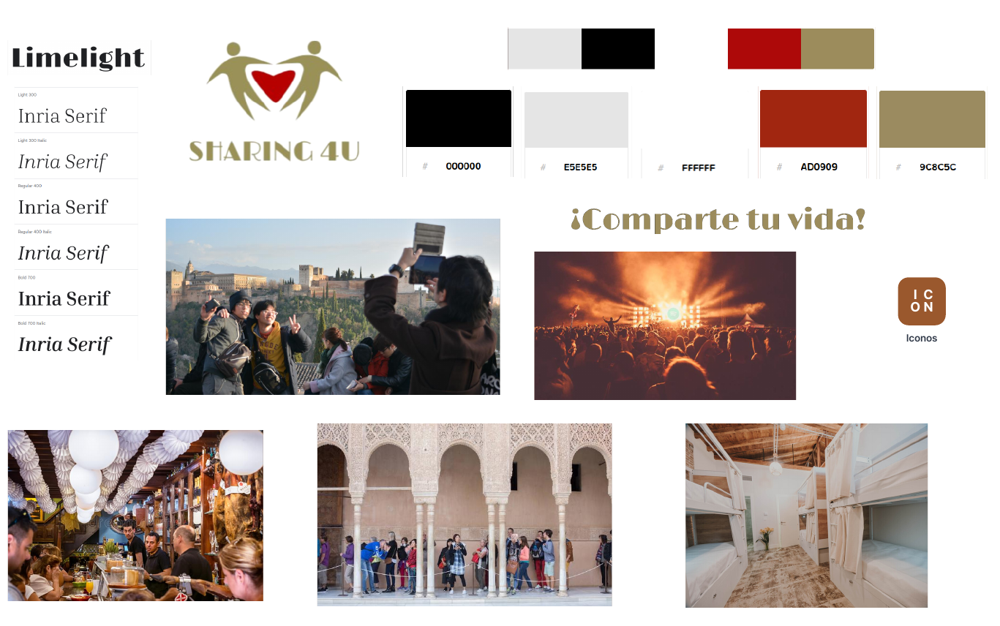
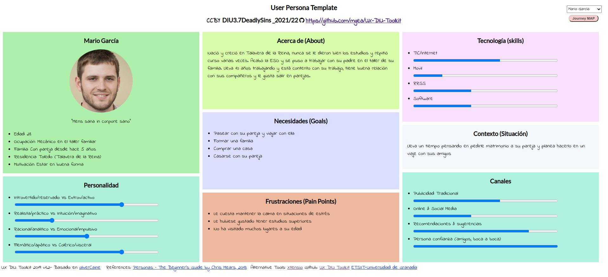
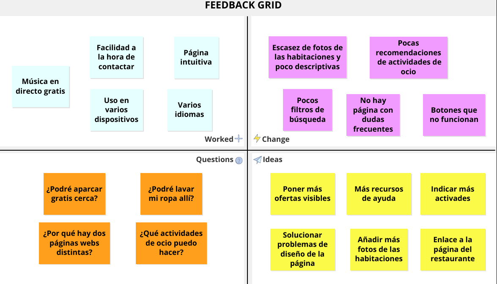
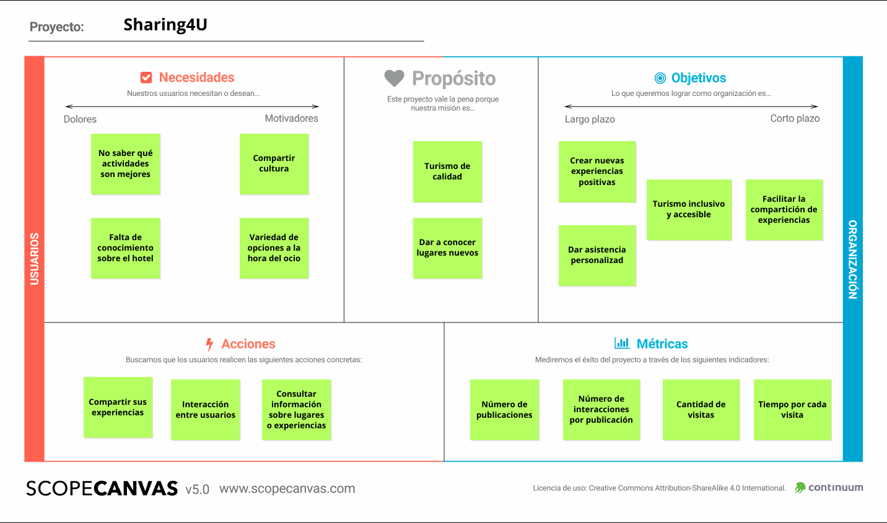

# DIU - Practica 3, entregables

> DIU3.7 Deadly Sins
>
> Francisco Cámara Parra
>
> Víctor Esteban Bota

## Moodboard (diseño visual + logotipo)   

Para comenzar, hemos realizado un Moodboard, usando imágenes que representas las actividad que van a realizar los usuarios de nuestra aplicación. La paleta de colores está inspirada en la página web del Hostel4U y son los que hemos utilizado para realizar tanto el logo como la landing page y la aplicación móvil.

Como fuentes hemos utilizado Limelight para el logo y el eslogán y Inria Serif para el resto de texto. Hemos realizado el moodboard usando la herramienta Milanote y se puede consultar el proyecto en el [siguiente enlace](https://app.milanote.com/1NMCdN1LzYu3ak?p=cQbuBJFJKk6). 

Por otro lado, hemos usado la página [DesignEvo](https://www.designevo.com/) para realizar el logo. Hemos elegido este diseño porque representa el enlace entre dos personas en torno a un corazón simbolizando el altruismo en compartir experiencias.

## Landing Page

También hemos realizado una landingpage del proyecto, usando de nuevo la paleta de colores escogida anteriormente y las fuentes.

Hemos intentado primar la simplicidad del diseño optando por un esquema más visual, transmitiendo el mensaje mediante imágenes y manteniendo el texto al mínimo.

La landing page se puede consultar [aquí](./Landing Page.pdf).

## Guidelines

Para decidir qué patrones debemos usar en nuestra aplicación, comenzamos analizando las distintas necesidades de los usuarios, qué esperan de nuestra aplicación y qué soluciones a estos requisitos se ajustan mejor.

Observando los patrones disponibles en la página [ui-patterns.com](http://ui-patterns.com/patterns), hemos considerado que los más adecuados son los siguientes:

- [Home Link](https://ui-patterns.com/patterns/HomeLink): para poder usar el logo de la app como botón de inicio.

- [Lazy Registration](https://ui-patterns.com/patterns/LazyRegistration): para que los usuarios puedan usar la aplicación sin la necesidad de registrarse.
- [Tagging](https://ui-patterns.com/patterns/Tag): para que se puedan añadir etiquetas a las publicaciones y eventos, con el fin de hacer más fáciles las búsquedas.
- [Search Filter](https://ui-patterns.com/patterns/LiveFilter): para poder realizar búsquedas ajustadas a las necesidades de cada usuario.
- [Horizontal Dropdown Menu](https://ui-patterns.com/patterns/HorizontalDropdownMenu): para el menú lateral desplegable desde cualquier sitio de la app.
- [Gallery](https://ui-patterns.com/patterns/Gallery): para que en una publicación o evento se pueda añadir una serie d.e imágenes con calidad.
- [ImageZoom](https://ui-patterns.com/patterns/ImageZoom): para poder hacer zoom sobre las imágenes.
- [Continuous Scrolling](https://ui-patterns.com/patterns/ContinuousScrolling): para desplazarse por los apartados de publicaciones y eventos.
- [Chat](https://ui-patterns.com/patterns/direct-messaging): para el apartado de chats, en el que los usuarios interaccionan entre sí a través de chats individuales o grupales.
- [Input Prompt](https://ui-patterns.com/patterns/InputPrompt): para esclarecer la información que requiere en el buscador.
- [Input Feedback](https://ui-patterns.com/patterns/InputFeedback): para que a la hora de registrarse el usuario sepa si los datos que ha introducido son correctos.

## Mockup: LAYOUT HI-FI

Basándonos en los wireframe que diseñamos en la práctica anterior y utilizando las fuentes, paleta de colores, y logo que hemos creado y estudiado anteriormente, recogemos nuestra propuesta de bocetos Hi-Fi (mockup) en [este documento](https://github.com/Mapachana/DIU21/blob/master/P3/mockup.pdf).

Este mockup se ha diseñado con Figma y para apreciar mejor el diseño se recomienda encarecidamente probar la simulación del prototipo [aquí](https://www.figma.com/proto/GZ9DgNMsXS9uuvSnfnhlr1/Sharing-4U?node-id=2%3A7&viewport=1891%2C674%2C0.41&scaling=scale-down&page-id=0%3A1&starting-point-node-id=2%3A7).

## Documentación: Publicación del Case Study

### Inspiración

Sharing4U surge como iniciativa para ofrecer a los usuarios que se alojan en el hostel actividades nuevas que pueden realizar durante su estancia. Esta aplicación pueden usarla tanto huéspedes como personas externas, también con el objetivo de atraer a gente al hostel y darlo a conocer.

En primer lugar, observamos las experiencias de nuestras Personas, Mario y Paloma, los cuales tenían la necesidad de encontrar y explorar nuevas actividades a realizar. Por un lado, tenemos a Mario, el cual no ha salido mucho de viaje y por tanto no sabía qué hacer en una nueva ciudad. Mientras tanto, en el caso de Paloma, debido a sus necesidades económicas, necesita explorar nuevas actividades diferentes a las habituales.

### Primeros pasos

Gracias a las vivencias de estas dos personas, y también a las nuestras propias, recogimos una serie de ideas y objetivos mediante la malla receptora de información y el Scope Canvas que posteriormente se reflejarían en nuestro propio diseño. 

Con estas premisas, creamos nuestros primeros bocetos de una versión simplificada de la aplicación, para luego ir dándole forma al proyecto. El wireframe realizado se puede consultar [aquí](../P2/Wireframe.pdf).

### Desarrollo del diseño 

Una vez asentada la idea, pensada la funcionalidad y diseñada la estructura de nuestra aplicación, empezamos creando un moodboard que recogiera todo lo que queríamos reflejar en el diseño de nuestra página: imágenes, colores representativos, un logo, fuentes que utilizaríamos. Así, dotando de una identidad visual a Sharing4U basada en la del Hostel4U.

Diseñamos una landing page que llamara la atención de los posibles usuarios tratando de hacerla simple y atractiva, dándole una gran importancia a la componente visual de la misma y reforzando las ventajas de usar nuestra aplicación.

La landing page se puede consultar [aquí]().

Finalmente, analizamos patrones de diseño que se ajustaran a las necesidades de los usuarios y retomamos los diseños que creamos anteriormente para dotarlos de la identidad de la aplicación.

La apariencia final de la aplicación se ve [aquí]().

### Conclusión

Partiendo de experiencias de personas ficticias y nuestras como inspiración, hemos podido desarrollar una aplicación centrada en dar opciones de actividades nuevas y de compartirlas con los demás. Además hemos aprendido nuevas técnicas de branding y diseño para así hacer nuestra aplicación, sencilla de usar y atractiva al público, cubriendo las necesidades básicas de los usuarios.