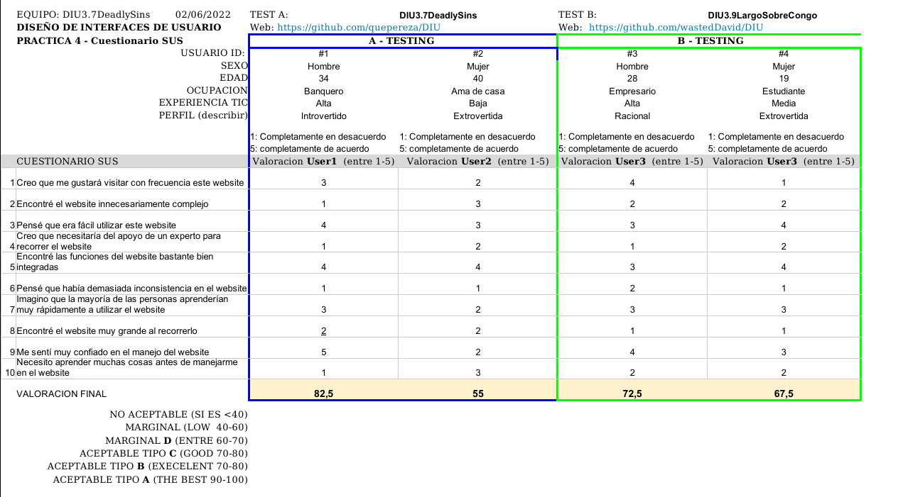

# DIU - Practica 4, entregables

> Francisco Cámara Parra
>
> Víctor Esteban Bota
>
> Repositorio: [DIU](https://github.com/quepereza/DIU)

##  4.a Caso asignado

Se nos han asignados dos casos: nuestro proyecto (caso A) y el proyecto del grupo Largo Sobre Congo (caso B):

### Caso A ([Sharing4U](https://github.com/quepereza/DIU))

Sharing4U es una aplicación diseñada para compartir experiencias con otros usuarios y estar al tanto de los próximos eventos. Las experiencias engloban tanto eventos de ocio, como turísticos o simplemente alguna vivencia que haya sido agradable y que se quiera compartir con el resto de usuarios.

### Caso B ([Menú gastronómico de Granada](https://github.com/wastedDavid/DIU))

Desarrollo de un menú gastronómico de la comida típica de la provincia para sacarle su máximo potencial y atraer a más clientes a visitar Granada. El microsite ofrece los servicios típicos: reserva, consultar carta, además de poder conocer un poco más la cultura e historia de los platos.

El caso A se centra más en el ocio de los usuarios y en ofrecer una amplia variedad de actividades y eventos tanto para la gente que se hospeda en el hostel como para la que no y así atraerlos a él, mientras que el caso B se enfoca en un apartado más gastronómico centrado en la ciudad de Granada y relacionado con el hostel para así atraer a más clientes al restaurante y así, al hostel.

##  4.b User Testing

| #ID  | Género/ Edad | Ocupación   | Experiencia TIC | Plataforma | Personalidad | Test | SUS SCORE |
| ---- | ------------ | ----------- | --------------- | ---------- | ------------ | ---- | --------- |
| 1    | H/34         | Banquero    | Alta            | Android    | Introvertido | A    | 82.5      |
| 2    | M/40         | Ama de casa | Baja            | Android    | Extrovertida | A    | 55        |
| 3    | H/28         | Empresario  | Alta            | Android    | Racional     | B    | 72.5      |
| 4    | M/19         | Estudiante  | Media           | Android    | Extrovertida | B    | 67.5      |

- El primer usuario es Manuel, un banquero minusválido, que tiene miedo de no encontrar ocio adaptado a sus condiciones.
- La segunda usuaria es María José, una ama de casa que desea realizar un viaje en familia, pero no tiene mucha experiencia programando viajes.
- El tercer usario es Carlos, un joven empresario que viaja por motivos de negocios.
- La cuarta usaria es Julia, estudiante de magisterio en Jaén, que decide hacer un viaje con sus amigos a Granada.

## . 4.c Cuestionario SUS

Tras realizar el cuestionario SUS las puntuaciones que vemos con respecto al caso A, difieren respecto a si tienes un alto conocimiento sobre informática y redes sociales, puesto que la usuaria 2 no sabe mucho sobre redes y eso se ve reflejado en su puntuación. Sin embargo, el usuario 1, el cual sí que posee un mayor conocimiento sobre redes, obtiene una puntuación alta siendo probable que recomiende el uso a sus conocidos.

Por otro lado, tenemos que puntuación de los usuarios 3 y 4 no difiere mucho entre sí, y no depende del nivel de conocimientos informáticos, ya que es una interfaz sencilla y entendible para la mayoría de la población. Como observación, en la usuaria 4, la cual es estudiante y tiene un nivel económico peor, esto se refleja en su puntuación, la cual es ligeramente inferior a la del usuario 4, el cual sí posee un mayor nivel económico.

Como conclusión, comparando ambos casos, observamos que el caso A depende mucho del nivel de conocimiento informáticos del usuario, a diferencia del caso B, el cual es más fácil de usar. Sin embargo, el caso A está dirigido hacia un público más amplio que el caso B, el cual podríamos decir que está más limitado por la capacidad económica del usuario.

##  4.d Usability Report

Puedes consultar el usability report [aquí]().

## Conclusiones

Tras hacer el A/B testing, aunque haya diferencia de puntos no hay que solo comparar respecto a este test, ya que los objetivos de ambos casos son diferentes y son completas en sus respectivos ámbitos.

Con respecto al caso B, la aplicación consigue su objetivo de atraer a clientes para el restaurante del hostel, ya que al no necesitar de muchos conocimientos TIC para usarla el público que la puede usar aumenta. Sin embargo, es verdad que se le podrían hacer unas cuantas mejoras, como se ha comentado en el usability report.