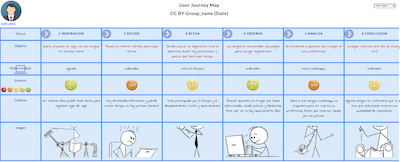

# DIU22
Prácticas Diseño Interfaces de Usuario 2021-22 (Tema: Hostels) 

Grupo: DIU3_7DeadlySins.  Curso: 2021/22 
Updated: 10/3/2022

Proyecto: **Sharing4U**

Descripción: 

Sharing4U es una aplicación diseñada para compartir experiencias con otros usuarios y estar al tanto de los próximos eventos. Las experiencias engloban tanto eventos de ocio, como turísticos o simplemente alguna vivencia que haya sido agradable y que se quiera compartir con el resto de usuarios.

Logotipo: 

Miembros
 * :bust_in_silhouette:   Francisco Cámara Parra     :octocat:     
 * :bust_in_silhouette:  Víctor Esteban Bota     :octocat:

-----

# Proceso de Diseño 

## Paso 1. UX Desk Research & Analisis 

 1.a Competitive Analysis
-----

|                                                        | **[Hostel4U](https://www.4uhostel.com/)** | **[TOC Hostel](https://tochostels.com/es/destino/granada/)** | **[The Hat Madrid](https://thehatmadrid.com/)** |
| :----------------------------------------------------: | :---------------------------------------: | :----------------------------------------------------------: | :---------------------------------------------: |
|                   **Reserva Online**                   |            :heavy_check_mark:             |                      :heavy_check_mark:                      |               :heavy_check_mark:                |
| **Imágenes de alojamiento accesibles y descriptivas**  |       :negative_squared_cross_mark:       |                      :heavy_check_mark:                      |          :negative_squared_cross_mark:          |
| **Oferta de actividades de entretenimiento y turismo** |       :negative_squared_cross_mark:       |                      :heavy_check_mark:                      |               :heavy_check_mark:                |
|   **Oferta de habitaciones exclusivas para chicas**    |            :heavy_check_mark:             |                      :heavy_check_mark:                      |               :heavy_check_mark:                |
|            **Ofertas para atraer clientes**            |            :heavy_check_mark:             |                :negative_squared_cross_mark:                 |               :heavy_check_mark:                |
|           **Foro de preguntas y respuestas**           |       :negative_squared_cross_mark:       |                      :heavy_check_mark:                      |               :heavy_check_mark:                |
|              **Página en varios idiomas**              |            :heavy_check_mark:             |                      :heavy_check_mark:                      |               :heavy_check_mark:                |

- **Hostel4U:** Es la página del hostel que tenemos que analizar en esta práctica. Se trata de una página para poder realizar reservas en un hostel cerca del centro de Granada. Se puede contactar tanto por teléfono como por email así como realizar reservas online. Se ven fotografías de las diferentes habitaciones aunque hay solo una por habitación. También tiene un bar donde se realizan diferentes actividades de ocio.
- **The Hat Madrid:** Hemos elegido este hostel porque es de una ciudad distinta y más grande. La opción de reservar no es muy llamativa a diferencia de las otras páginas (está en la esquina superior izquierda y con letra muy pequeña). Las fotos de las diferentes habitaciones se repiten y hay algunos enlaces que no funcionan. También ofrecen actividades y servicios gratuitos pero no indican cómo acceder a ellos.
- **TOC Hostel:** Este hostel es también de Granada, cerca de la Catedral, aunque es una franquicia y hay en más lugares de España. Hemos elegido este hostel porque es de la misma ciudad que el que vamos a analizar y porque la interfaz es muy intuitiva, hay gran variedad de fotos y ofrece una gran cantidad de información detallada acerca de sus servicios y actividades.

 1.b Persona
-----

Nuestra primera Persona creada es Mario, el cual no ha viajado mucho con lo que no se maneja bien a la hora de hacer reservas por internet o buscar actividades, pero tiene ganas de conocer mundo junto a su pareja y hacerle una propuesta especial.

Tenemos también a Paloma, la cual es una influencer con ganas de compartir sus experiencias en redes para así ganar visibilidad, pero no tiene un gran presupuesto, ya que terminó de estudiar hace poco y todavía no trabaja.

 1.c User Journey Map
----

Hemos elegido esta experiencia porque es algo normal no saber dónde buscar alojamientos ni qué actividades realizar. También es común tener que tomar decisiones por un grupo.

Hemos elegido esta experiencia porque creemos que es algo habitual encontrar sitios baratos sin disponibilidad y tener que buscar otros. También es algo común tener un bajo presupuesto.

 1.d Usability Review
----
**Enlace**: [Usability Review Document](https://github.com/quepereza/DIU/blob/master/P1/Usability-review-template.pdf)

**Valoración Final**: 80 (Good)

**Comentarios**: En general, la página está bien a nivel de usabilidad e interfaz, pero hay ciertos aspectos que podrían mejorar, como el añadir una página de ayuda, o mejorar los criterios de búsqueda a la hora de hacer una reserva, por ejemplo filtrar por precio o por tipo de habitación.

## Paso 2. UX Design  

 2.a Feedback Capture Grid / EMpathy map / POV
----

Hemos realizado una malla receptora de información basándonos en las experiencias de nuestros usuarios ficticios de la práctica 1. Para ello, nos hemos planteado qué sugerencias podrían tener los usuarios y cuáles tendrían los desarrolladores:

 2.b ScopeCanvas
----
Nuestra propuesta es crear una plataforma que brinde un espacio en el que los usuarios puedan compartir sus experiencias en su viaje. Pueden compartir su opinión sobre el hostel y recomendar distintas actividades de ocio cercanas o lugares a visitar.

 2.b Tasks analysis 
-----

En esta tabla se identifican las tareas y su relevancia para los usuarios. Distinguimos entre tres grupos de usuario:

- **Usuarios Registrados**: Usuario con una cuenta creada en la aplicación. Podrá postear e interactuar con otros usuarios registrados

- **Usuarios No Registrados**: Usuario que visita la aplicación y podrá ver las diferentes publicaciones.

- **Moderador**: Personal del hostel que publica diferentes ofertas y también controla que los usuarios sigan las normas de la comunidad.

  En negrita están las tareas más importantes:

|    Grupos de usuario    | Usuarios Registrados | Usuarios No Registrados | Moderador |
| :---------------------: | :------------------: | :---------------------: | :-------: |
| **Buscar actividades**  |         ALTA         |          ALTA           |   BAJA    |
| **Añadir comentarios**  |        MEDIA         |        NO PUEDE         |   BAJA    |
|  Eliminar comentarios   |         BAJA         |        NO PUEDE         |   MEDIA   |
|   Editar comentarios    |         BAJA         |        NO PUEDE         |   BAJA    |
| **Añadir publicación**  |         ALTA         |        NO PUEDE         |   MEDIA   |
|  Eliminar publicación   |         BAJA         |        NO PUEDE         |   MEDIA   |
|   Editar publicación    |         BAJA         |        NO PUEDE         |   BAJA    |
|     **Registrarse**     |       NO PUEDE       |          MEDIA          | NO PUEDE  |
|   **Iniciar sesión**    |         ALTA         |        NO PUEDE         |   ALTA    |
|      Cerrar sesión      |        MEDIA         |        NO PUEDE         |   BAJA    |
|      Darse de baja      |         BAJA         |        NO PUEDE         |   BAJA    |
|     Cambiar idioma      |        MEDIA         |          MEDIA          |   BAJA    |
|     Banear cuentas      |       NO PUEDE       |        NO PUEDE         |   MEDIA   |
|   **Unirse a chats**    |         ALTA         |        NO PUEDE         |   MEDIA   |
|    Salirse de chats     |         BAJA         |        NO PUEDE         |   BAJA    |
| **Filtrar actividades** |         ALTA         |          ALTA           |   MEDIA   |
|  **Consultar eventos**  |         ALTA         |          ALTA           |   BAJA    |
|  Recuperar contraseña   |         BAJA         |        NO PUEDE         |   BAJA    |
|     Añadir eventos      |       NO PUEDE       |        NO PUEDE         |   MEDIA   |
|     Retirar eventos     |       NO PUEDE       |        NO PUEDE         |   MEDIA   |

 2.c IA: Sitemap + Labelling 
----

Desarrollamos el mapa web de la aplicación. En azul indicamos las páginas a las que puede acceder todos los tipos de usuario, en amarillo aparecen las páginas a las cuales pueden acceder los usuarios registrados y moderadores y en morado a las que solo pueden acceder los moderadores.

 2.d Wireframes
-----

Finalmente, hemos realizado un prototipo Lo-Fi de nuestra aplicación (es una aplicación móvil, que también tendrá una versión web). Este prototipo es esquemático y es solo para tener un esquema general. Los detalles de diseño finales los ultimaremos en las siguientes prácticas.

#### Esquema general

 

##### Página de inicio

##### Publicaciones

##### Chats

##### Eventos

### 

## Paso 3. Mi UX-Case Study (diseño)

 3.a Moodboard
-----

Para comenzar, hemos realizado un Moodboard, usando imágenes que representas las actividad que van a realizar los usuarios de nuestra aplicación. La paleta de colores está inspirada en la página web del Hostel4U y son los que hemos utilizado para realizar tanto el logo como la landing page y la aplicación móvil.

Como fuentes hemos utilizado Limelight para el logo y el eslogán y Inria Serif para el resto de texto. Hemos realizado el moodboard usando la herramienta Milanote y se puede consultar el proyecto en el [siguiente enlace](https://app.milanote.com/1NMCdN1LzYu3ak?p=cQbuBJFJKk6). 

Por otro lado, hemos usado la página [DesignEvo](https://www.designevo.com/) para realizar el logo. Hemos elegido este diseño porque representa el enlace entre dos personas en torno a un corazón simbolizando el altruismo en compartir experiencias.

  3.b Landing Page
----

También hemos realizado una landingpage del proyecto, usando de nuevo la paleta de colores escogida anteriormente y las fuentes.

Hemos intentado primar la simplicidad del diseño optando por un esquema más visual, transmitiendo el mensaje mediante imágenes y manteniendo el texto al mínimo.

La landing page se puede consultar [aquí](https://github.com/quepereza/DIU/blob/master/P3/Landing%20Page.pdf).

 3.c Guidelines
----

Para decidir qué patrones debemos usar en nuestra aplicación, comenzamos analizando las distintas necesidades de los usuarios, qué esperan de nuestra aplicación y qué soluciones a estos requisitos se ajustan mejor.

Observando los patrones disponibles en la página [ui-patterns.com](http://ui-patterns.com/patterns), hemos considerado que los más adecuados son los siguientes:

- [Home Link](https://ui-patterns.com/patterns/HomeLink): para poder usar el logo de la app como botón de inicio.
- [Lazy Registration](https://ui-patterns.com/patterns/LazyRegistration): para que los usuarios puedan usar la aplicación sin la necesidad de registrarse.
- [Tagging](https://ui-patterns.com/patterns/Tag): para que se puedan añadir etiquetas a las publicaciones y eventos, con el fin de hacer más fáciles las búsquedas.
- [Search Filter](https://ui-patterns.com/patterns/LiveFilter): para poder realizar búsquedas ajustadas a las necesidades de cada usuario.
- [Horizontal Dropdown Menu](https://ui-patterns.com/patterns/HorizontalDropdownMenu): para el menú lateral desplegable desde cualquier sitio de la app.
- [Gallery](https://ui-patterns.com/patterns/Gallery): para que en una publicación o evento se pueda añadir una serie d.e imágenes con calidad.
- [ImageZoom](https://ui-patterns.com/patterns/ImageZoom): para poder hacer zoom sobre las imágenes.
- [Continuous Scrolling](https://ui-patterns.com/patterns/ContinuousScrolling): para desplazarse por los apartados de publicaciones y eventos.
- [Chat](https://ui-patterns.com/patterns/direct-messaging): para el apartado de chats, en el que los usuarios interaccionan entre sí a través de chats individuales o grupales.
- [Input Prompt](https://ui-patterns.com/patterns/InputPrompt): para esclarecer la información que requiere en el buscador.
- [Input Feedback](https://ui-patterns.com/patterns/InputFeedback): para que a la hora de registrarse el usuario sepa si los datos que ha introducido son correctos.

 

  3.d Mockup
----

Basándonos en los wireframe que diseñamos en la práctica anterior y utilizando las fuentes, paleta de colores, y logo que hemos creado y estudiado anteriormente, recogemos nuestra propuesta de bocetos Hi-Fi (mockup) en [este documento](https://github.com/Mapachana/DIU21/blob/master/P3/mockup.pdf).

Este mockup se ha diseñado con Figma y para apreciar mejor el diseño se recomienda encarecidamente probar la [simulación del prototipo aquí](https://www.figma.com/proto/GZ9DgNMsXS9uuvSnfnhlr1/Sharing-4U?node-id=2%3A7&viewport=1891%2C674%2C0.41&scaling=scale-down&page-id=0%3A1&starting-point-node-id=2%3A7).

 3.e ¿My UX-Case Study?
-----

### Inspiración

Sharing4U surge como iniciativa para ofrecer a los usuarios que se alojan en el hostel actividades nuevas que pueden realizar durante su estancia. Esta aplicación pueden usarla tanto huéspedes como personas externas, también con el objetivo de atraer a gente al hostel y darlo a conocer.

En primer lugar, observamos las experiencias de nuestras Personas, Mario y Paloma, los cuales tenían la necesidad de encontrar y explorar nuevas actividades a realizar. Por un lado, tenemos a Mario, el cual no ha salido mucho de viaje y por tanto no sabía qué hacer en una nueva ciudad. Mientras tanto, en el caso de Paloma, debido a sus necesidades económicas, necesita explorar nuevas actividades diferentes a las habituales.

### Primeros pasos

Gracias a las vivencias de estas dos personas, y también a las nuestras propias, recogimos una serie de ideas y objetivos mediante la malla receptora de información y el Scope Canvas que posteriormente se reflejarían en nuestro propio diseño. 

Con estas premisas, creamos nuestros primeros bocetos de una versión simplificada de la aplicación, para luego ir dándole forma al proyecto. El wireframe realizado se puede consultar [aquí](https://github.com/quepereza/DIU/blob/master/P2/Wireframe.pdf).

### Desarrollo del diseño 

Una vez asentada la idea, pensada la funcionalidad y diseñada la estructura de nuestra aplicación, empezamos creando un moodboard que recogiera todo lo que queríamos reflejar en el diseño de nuestra página: imágenes, colores representativos, un logo, fuentes que utilizaríamos. Así, dotando de una identidad visual a Sharing4U basada en la del Hostel4U.

Diseñamos una landing page que llamara la atención de los posibles usuarios tratando de hacerla simple y atractiva, dándole una gran importancia a la componente visual de la misma y reforzando las ventajas de usar nuestra aplicación.

La landing page se puede consultar [aquí](https://github.com/quepereza/DIU/blob/master/P3/Landing%20Page.pdf).

Finalmente, analizamos patrones de diseño que se ajustaran a las necesidades de los usuarios y retomamos los diseños que creamos anteriormente para dotarlos de la identidad de la aplicación.

La apariencia final de la aplicación se puede ver [aquí](https://www.figma.com/proto/GZ9DgNMsXS9uuvSnfnhlr1/Sharing-4U?node-id=2%3A7&viewport=1906%2C774%2C0.31&scaling=scale-down&page-id=0%3A1&starting-point-node-id=2%3A7) en forma de prototipo interactivo creado utilizando Figma.

### Conclusión

Partiendo de experiencias de personas ficticias y nuestras como inspiración, hemos podido desarrollar una aplicación centrada en dar opciones de actividades nuevas y de compartirlas con los demás. Además hemos aprendido nuevas técnicas de branding y diseño para así hacer nuestra aplicación, sencilla de usar y atractiva al público, cubriendo las necesidades básicas de los usuarios.

## Paso 4. Evaluación 

 4.a Caso asignado
----

>>> Breve descripción del caso asignado con enlace a  su repositorio Github

 4.b User Testing
----

>>> Seleccione 4 personas ficticias. Exprese las ideas de posibles situaciones conflictivas de esa persona en las propuestas evaluadas. Asigne dos a Caso A y 2 al caso B

| Usuarios | Sexo/Edad     | Ocupación   |  Exp.TIC    | Personalidad | Plataforma | TestA/B
| ------------- | -------- | ----------- | ----------- | -----------  | ---------- | ----
| User1's name  | H / 18   | Estudiante  | Media       | Introvertido | Web.       | A 
| User2's name  | H / 18   | Estudiante  | Media       | Timido       | Web        | A 
| User3's name  | M / 35   | Abogado     | Baja        | Emocional    | móvil      | B 
| User4's name  | H / 18   | Estudiante  | Media       | Racional     | Web        | B 

. 4.c Cuestionario SUS
----

>>> Usaremos el **Cuestionario SUS** para valorar la satisfacción de cada usuario con el diseño (A/B) realizado. Para ello usamos la [hoja de cálculo](https://github.com/mgea/DIU19/blob/master/Cuestionario%20SUS%20DIU.xlsx) para calcular resultados sigiendo las pautas para usar la escala SUS e interpretar los resultados
http://usabilitygeek.com/how-to-use-the-system-usability-scale-sus-to-evaluate-the-usability-of-your-website/)
Para más información, consultar aquí sobre la [metodología SUS](https://cui.unige.ch/isi/icle-wiki/_media/ipm:test-suschapt.pdf)

>>> Adjuntar captura de imagen con los resultados + Valoración personal 

 4.d Usability Report
----

>> Añadir report de usabilidad para práctica B (la de los compañeros)

>>> Valoración personal 

>>> ## Paso 5. Evaluación de Accesibilidad  (no necesaria)

>>>   5.a Accesibility evaluation Report 
>>>
>>> > ----

>>> Indica qué pretendes evaluar (de accesibilidad) sobre qué APP y qué resultados has obtenido 

>>> 5.a) Evaluación de la Accesibilidad (con simuladores o verificación de WACG) 
>>> 5.b) Uso de simuladores de accesibilidad 

>>> (uso de tabla de datos, indicar herramientas usadas) 

>>> 5.c Breve resumen del estudio de accesibilidad (de práctica 1) y puntos fuertes y de mejora de los criterios de accesibilidad de tu diseño propuesto en Práctica 4.

## Conclusión final / Valoración de las prácticas

>>> (90-150 palabras) Opinión del proceso de desarrollo de diseño siguiendo metodología UX y valoración (positiva /negativa) de los resultados obtenidos  

